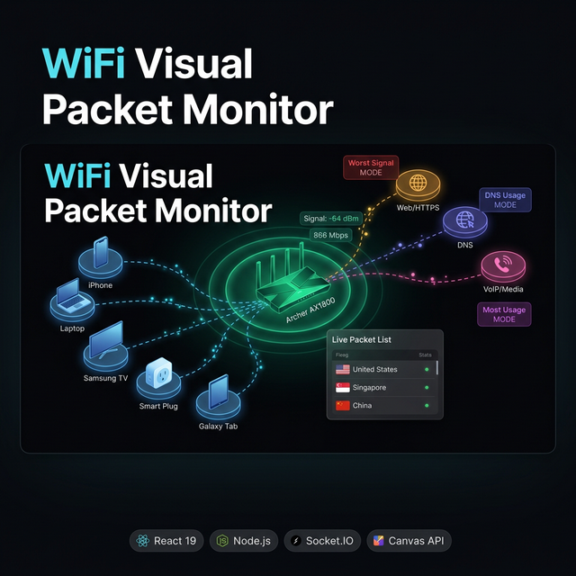

<div align="center">

# 📡 WiFi Visual Packet Monitor



**Real-time network visualization for your home. See every device, every packet, every country — live.**

> ⚡ Built with React + Vite (frontend) · Node.js + Socket.IO (backend) · Canvas API (visualizer)

[](https://react.dev)
[](https://vitejs.dev)
[](https://nodejs.org)
[](https://socket.io)
[](./LICENSE)

</div>

---

> Designed for the **TP-Link Archer AX1800** but works with any home router on a local network.

A real-time network visualizer for your home WiFi. See every device connected to your router, watch live packet traffic flow across countries, analyse signal quality, data usage, and connection time — all in a slick dark-mode dashboard.

> ⚡ Built with React + Vite (frontend) · Node.js + Socket.IO (backend) · Canvas API (visualizer)

---

## ✨ Features

| Feature | Description |
|---|---|
| 🗺️ **Network Map** | Live canvas visualization of all devices connected to your router |
| 📦 **Packet Inspector** | Real-time stream of every packet with source, destination, protocol, and size |
| 🌍 **Geo-Distribution** | See which countries your traffic is flowing to with country flags |
| 📶 **Worst Signal Filter** | Instantly highlight the device with the worst WiFi signal |
| 📊 **Most Usage Filter** | Identify the top bandwidth consumer on your network |
| ⏱️ **Longest Connected** | Find the device that has been online the longest (node size scales by uptime) |
| 🚫 **Device Blocking** | Temporarily restrict a device's simulated packet traffic via the Admin panel |
| 🖱️ **Drag & Drop Nodes** | Re-arrange nodes on the network map to match your mental model |
| 🏷️ **Friendly Labels** | Devices automatically labelled as "My Phone", "My Laptop", etc. |
| 🔍 **Packet Search** | Search packets by IP, protocol, country name, or port number |

---

## 🖼️ Preview

```
[Router Node] ──────── [My Phone]
     │                 [My Laptop]
     │                 [Galaxy Phone]
     └──── [Web/HTTPS] [DNS/System] [VoIP/Media]
```

Nodes glow, pulse, and scale based on the active visual mode.

---

## 🚀 Getting Started

### Prerequisites

- **Node.js** v18 or higher
- **npm** v8 or higher
- A Windows/Linux machine connected to a local WiFi network

### 1. Clone the repo

```bash
git clone https://github.com/YOUR_USERNAME/wifi-visual-packet.git
cd wifi-visual-packet
```

### 2. Install dependencies

```bash
npm install
```

### 3. Configure your environment

```bash
cp .env.example .env
```

Then open `.env` and fill in your details:

```env
PORT=3001
ROUTER_SSID=YOUR_WIFI_NAME
ROUTER_IP=192.168.0.1
ROUTER_ADMIN_USER=admin
ROUTER_ADMIN_PASSWORD=your_router_password_here
```

> ⚠️ **NEVER commit `.env` to git.** It is already in `.gitignore`.

### 4. Run the app

```bash
npm start
```

This starts both the Node.js backend (port 3001) and the Vite frontend (port 5173) concurrently.

Open your browser at **http://localhost:5173**

---

## 🔧 Project Structure

```
wifi-visual-packet/
├── server/
│   └── server.js          ← Node.js + Socket.IO backend (device scan + packet simulation)
├── src/
│   ├── App.jsx            ← Main React app + sidebar + packet inspector
│   ├── index.css          ← Manual utility CSS (no Tailwind required at runtime)
│   └── components/
│       ├── Visualizer.jsx ← Canvas-based network map
│       └── DeviceModal.jsx← Device detail popup with admin firewall controls
├── .env.example           ← Safe config template (commit this)
├── .env                   ← Your private config (DO NOT COMMIT)
├── .gitignore
└── package.json
```

---

## 🎮 Usage Guide

### Network Map Controls
- **Click** a device node → opens the Device Detail modal
- **Drag** any node → reposition it on the canvas
- **Hover** a node → see a quick tooltip (signal, MAC, type)

### Sidebar Filters
| Button | What it does |
|---|---|
| **Worst Signal** | Highlights the weakest WiFi device in red |
| **Most Usage** | Scales nodes by bandwidth consumed (purple mode) |
| **Longest Connected** | Scales nodes by uptime (blue mode, larger = older connection) |
| **Global Footprint** | Opens a panel listing all countries detected in packet traffic |

### Device Modal (click any client device)
- View hardware specs (MAC, vendor, connection type)
- Scroll through the live **traffic log** with geo flags
- **Admin Firewall Control** — enter password to block/unblock packet traffic

---

## 🔒 Security Notes

- The "Admin Firewall Control" in the UI is currently **simulated** — it blocks packets within the app's in-memory stream only, not your actual router.
- For real hardware-level blocking, you would need to integrate with your router's admin API (e.g. via `ROUTER_ADMIN_PASSWORD` in `.env`).
- Never expose this dashboard on a public network without authentication.

---

## 🧩 Tech Stack

| Layer | Tech |
|---|---|
| Frontend | React 19, Vite 7 |
| Visualizer | HTML5 Canvas API |
| Backend | Node.js, Express, Socket.IO |
| Device Discovery | `local-devices` (ARP scan) |
| Packet Simulation | Custom interval-based simulator |
| Styling | Vanilla CSS utility classes |
| Icons | `lucide-react` |

---

## 📝 Environment Variables

| Variable | Default | Description |
|---|---|---|
| `PORT` | `3001` | Backend server port |
| `ROUTER_SSID` | `TIME2E30` | Your WiFi SSID (shown on router node) |
| `ROUTER_IP` | `192.168.0.1` | Your router's local IP |
| `ROUTER_ADMIN_USER` | `admin` | Router admin username |
| `ROUTER_ADMIN_PASSWORD` | _(none)_ | Router admin password |
| `SCAN_INTERVAL_MS` | `30000` | How often to scan for new devices (ms) |

---

## 🤝 Contributing

PRs are welcome! Please:
1. Fork the repo
2. Create a feature branch: `git checkout -b feature/my-feature`
3. Commit your changes: `git commit -m 'feat: add something'`
4. Push and open a PR

---

## 📄 License

ISC © 2026
